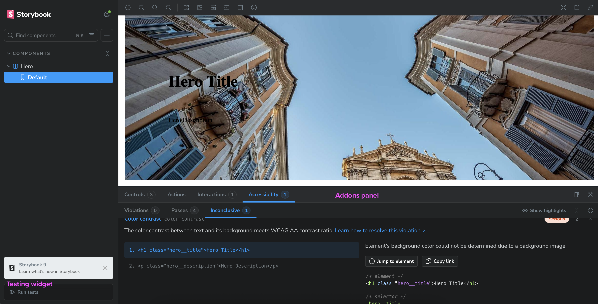

import ExternalLink from "@/components/ExternalLink.astro";
import InternalLink from "@/components/InternalLink.astro";

<ExternalLink href="https://github.com/italodr/demo-component-library/commit/e791f628b75db2f3ebd02d223735281d21426519">Enlace al commit en Github de este capítulo</ExternalLink>

## ¿Por qué Storybook?

- Entorno visual para testear y documentar componentes.
- Facilita el diseño colaborativo y la revisión por parte de diseñadores o QA.
- Permite escribir documentación técnica y de diseño en MDX.
- Integra addons para accesibilidad, control de props, tests visuales, etc.

## Estructura recomendada

Añadiremos Storybook como proyecto independiente dentro del workspace `docs/`:

```text
docs/
└── .storybook/           # Configuración global
│   ├── main.ts
│   ├── preview.ts
│   └── vitest.setup.ts
├── package.json
├── vitest.config.ts
└── vitest.shims.d.ts
```

Y los `*.stories.tsx` estarán distribuidos en cada paquete (ej. `packages/hero/src/Hero.stories.tsx`).

## Instalación en el workspace docs

Podríamos seguir la instalación de Storybook desde la raíz del monorepo, pero es mejor crear un proyecto Storybook independiente en el workspace `docs/`. Ya que storybook añade varias dependencias y archivos que no son necesarios en el monorepo.

Creamos el archivo `package.json` en `docs/`:

```json
{
  "name": "@myui/docs",
  "private": true,
  "version": "1.0.0",
  "type": "module",
  "scripts": {
    "dev": "storybook dev -p 6006",
    "build": "storybook build"
  },
  "dependencies": {
    "react": "^19.1.0",
    "react-dom": "^19.1.0"
  },
  "devDependencies": {
    "@storybook/addon-a11y": "^9.0.18",
    "@storybook/react-vite": "^9.0.18",
    "@storybook/addon-vitest": "^9.0.18",
    "@types/react": "^19.1.8",
    "@types/react-dom": "^19.1.6",
    "storybook": "^9.0.18",
    "typescript": "~5.8.3",
    "@vitest/browser": "^3.2.4",
    "playwright": "^1.54.1",
    "@vitest/coverage-v8": "^3.2.4"
  }
}
```

Y añadimos las dependencias en el `package.json` de la raíz del proyecto:

```json
"devDependencies": {
  "@storybook/react-vite": "^9.0.18",
  "@storybook/test": "^8.6.14",
  ...
}
```

Creamos el archivo `main.ts` en `docs/.storybook/`:

```ts
import type { StorybookConfig } from '@storybook/react-vite';

import { join, dirname } from "path";

function getAbsolutePath(value: string): any {
  return dirname(require.resolve(join(value, 'package.json')))
}
const config: StorybookConfig = {
  "stories": [
    "../../packages/**/*.mdx",
    "../../packages/**/*.stories.@(js|jsx|mjs|ts|tsx)"
  ],
  "addons": [
    getAbsolutePath("@storybook/addon-a11y"),
    getAbsolutePath("@storybook/addon-vitest")
  ],
  "framework": {
    "name": getAbsolutePath('@storybook/react-vite'),
    "options": {},
  }
};
export default config;
```

La función `getAbsolutePath` es una utilidad para obtener la ruta absoluta de un archivo, ya que estamos en un monorepo.

Creamos el archivo `preview.ts` en `docs/.storybook/`:

```ts
import type { Preview } from "@storybook/react-vite";

const preview: Preview = {
  parameters: {
    controls: {
      matchers: {
       color: /(background|color)$/i,
       date: /Date$/i,
      },
    },
    a11y: {
      context: "body",
      config: {},
      options: {},
      test: "todo"
    },
    globals: {
      a11y: {
        manual: true,
      },
    },
  },
};
export default preview;
```

La opción de `a11y.test` puede tener los siguientes valores:

- `todo`: muestra las violaciones de accesibilidad en la interfaz de pruebas.
- `error`: falla en CI si hay violaciones de accesibilidad.
- `off`: salta las comprobaciones de accesibilidad.

Creamos el archivo `vitest.setup.ts` en `docs/.storybook/`:

```ts
import * as a11yAddonAnnotations from "@storybook/addon-a11y/preview";
import { setProjectAnnotations } from '@storybook/react-vite';
import * as projectAnnotations from './preview';

setProjectAnnotations([a11yAddonAnnotations, projectAnnotations]);
```

Creamos el archivo `vitest.shims.d.ts` en `docs/.storybook/`:

```ts
/// <reference types="@vitest/browser/providers/playwright" />
```

Creamos el archivo `vitest.config.ts` en `docs/.storybook/`:

```ts
/// <reference types="vitest/config" />
import { defineConfig } from "vitest/config";
import path from "path";
import { fileURLToPath } from "node:url";
import { storybookTest } from "@storybook/addon-vitest/vitest-plugin";
const dirname = typeof __dirname !== "undefined" ? __dirname : path.dirname(fileURLToPath(import.meta.url));

export default defineConfig({
  test: {
    globals: true,
    environment: "jsdom",
    setupFiles: [path.resolve(__dirname, "../setupTests.js")],
    projects: [{
      extends: true,
      plugins: [
      storybookTest({
        configDir: path.join(dirname, ".storybook")
      })],
      test: {
        name: "storybook",
        browser: {
          enabled: true,
          headless: true,
          provider: "playwright",
          instances: [{
            browser: "chromium"
          }]
        },
        setupFiles: ["./.storybook/vitest.setup.ts"]
      }
    }]
  }
});
```

Reutilizaremos el archivo `setupTests.js` de la raíz del proyecto, creado en el capítulo anterior.

Creamos una story por componente (ej. `packages/hero/src/Hero.stories.tsx`):

```tsx
import type { Meta, StoryObj } from "@storybook/react-vite";
import { expect } from "@storybook/test";

import { Hero } from "./Hero";
import "./styles.css";

const meta: Meta<typeof Hero> = {
  component: Hero,
  title: "Components/Hero",
  tags: ["autodocs"],
};

export default meta;
type Story = StoryObj<typeof Hero>;

export const Default: Story = {
  args: {
    title: "Hero Title",
    description: "Hero Description",
    image: "https://picsum.photos/1920/1080",
  },
  play: async ({ canvas }) => {
    await expect(canvas.getByRole("heading", { name: "Hero Title" })).toHaveTextContent("Hero Title");
  },
};
```

Arreglamos un par de typos que teníamos en el componente `Hero.tsx`:

```tsx
const backgroundImage = image ? { backgroundImage: `url(${image})` } : {};
return (
  <section
      className={`hero ${className ?? ""}`}
      ...
```

Había una coma en la url de la imagen que no nos permitía ver la imagen. Y si no se le pasaba el parámetro de `className` imprimía "undefined".

Y aprovechamos para envolver los estilos con un [Cascade Layers](/cascade-layers):

```css
@layer components {
  ...
}
```

De esta manera, modularizamos los estilos y evitamos que se vean afectados por los estilos de otros componentes.

## Ejecutar Storybook

```bash
pnpm dev --filter=@myui/docs
```

Este comando ejecuta Storybook y abrirá el navegador automáticamente. Veréis que tenemos acceso a las pestañas de `Interactions` y `Accessibility` en el panel de addons y nos aparece también el `testing widget` en el sidebar.



Ahora podemos ver que el componente `Hero` está funcionando correctamente. Aunque tiene problemas de accesibilidad por tener texto encima de una imagen, pero la solución no entra en el objetivo de esta guía.

## Próximo capítulo

En el capítulo 5 realizaremos el versionado semántico y la publicación con Changesets:

- Instalación y configuración de @changesets/cli
- Flujo de trabajo con changeset, version, publish
- Cómo versionar múltiples paquetes y publicar con pnpm
- Tagging y manejo de versiones internas vs públicas

<InternalLink href="/libreria-de-componentes-en-monorepo/versionado-semantico-y-publicacion-con-changeset">Ir al siguiente capítulo</InternalLink><br /><br />
<InternalLink href="/libreria-de-componentes-en-monorepo">Volver a la lista de capítulos</InternalLink>
